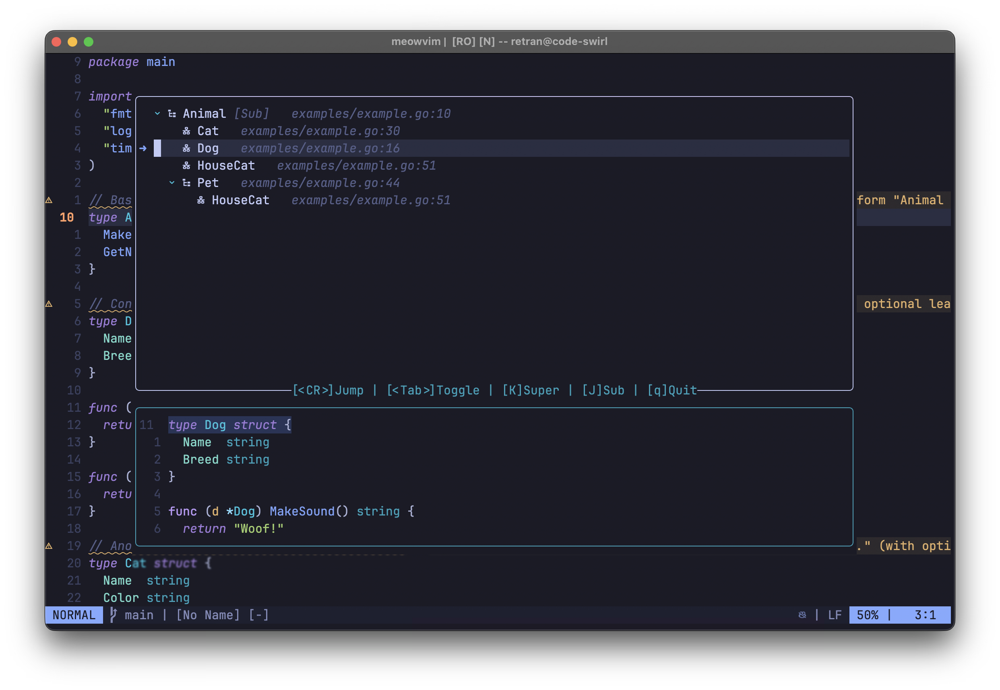
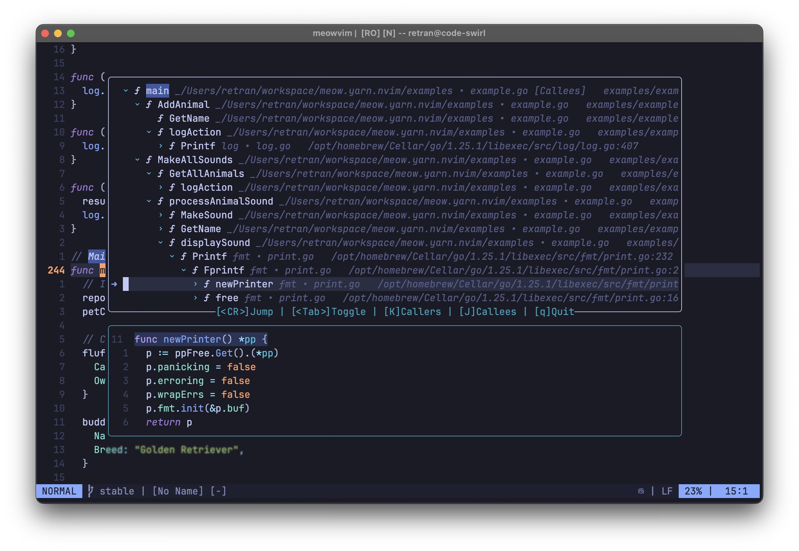

# 🐱 meow.yarn.nvim

> A purr-fectly simple way to visualize LSP hierarchies in Neovim.

<div align="center">


</div>

<div align="center">

<br />

<strong>meow.yarn.nvim - Untangle Your Code's Relationships</strong>

</div>

Ever feel like you're unraveling a tangled ball of yarn when navigating your codebase? `meow.yarn.nvim` is here to help. It provides a simple, beautiful, and interactive way to explore LSP hierarchies without the usual clutter. Forget getting lost in endless definitions and references; **`meow.yarn.nvim` visualizes type and call hierarchies in a clean, intuitive tree view**.

---

## Screenshots

<div align="center">




</div>

---

## Key Features

- **Clean, Interactive Tree**: Shows hierarchies in a straightforward, expandable list
- **Type & Call Hierarchies**: Explore both supertypes/subtypes and callers/callees of functions
- **Live Preview**: Instantly see the relevant code for any item you select in the tree
- **Jump to Definition**: Press Enter on any item to go directly to its location in the code
- **Explore Deeper**: Pick any symbol in the tree and make it the new starting point for exploration, or switch directions (e.g., from callers to callees) on the fly
- **Fast & Non-Blocking**: Fully asynchronous so it won't freeze your Neovim
- **Built on Solid Foundations**: Powered by Neovim's native LSP and [nui.nvim](https://github.com/MunifTanjim/nui.nvim)

---

## Prerequisites

### Required

| Requirement      | Details                                                                                |
| ---------------- | -------------------------------------------------------------------------------------- |
| **Neovim**       | ≥ 0.8.0                                                                                |
| **LSP Client**   | An active LSP server that supports `typeHierarchyProvider` or `callHierarchyProvider`. |
| **Dependencies** | [nui.nvim](https://github.com/MunifTanjim/nui.nvim)                                    |

---

## Getting Started

### Installation

Install `meow.yarn.nvim` using your favorite plugin manager.

#### [lazy.nvim](https://github.com/folke/lazy.nvim)

```lua
{
    "retran/meow.yarn.nvim",
    dependencies = { "MunifTanjim/nui.nvim" },
    config = function()
        require("meow.yarn").setup({
            -- Your custom configuration goes here
        })
    end,
}
```

#### [packer.nvim](https://github.com/wbthomason/packer.nvim)

```lua
use {
    "retran/meow.yarn.nvim",
    requires = { "MunifTanjim/nui.nvim" },
    config = function()
        require("meow.yarn").setup({})
    end,
}
```

#### [rocks.nvim](https://github.com/lumen-oss/rocks.nvim)

```vim
:Rocks install meow.yarn.nvim
```

The dependency (nui.nvim) will be automatically installed and managed.
Then add to your Neovim configuration:

```lua
require("meow.yarn").setup({
    -- Your custom configuration goes here
})
```

### Quick Start

The plugin provides the `:MeowYarn` command to open hierarchy views.

- **View Type Hierarchy (Supertypes):** `:MeowYarn type super`
- **View Type Hierarchy (Subtypes):** `:MeowYarn type sub`
- **View Call Hierarchy (Callers):** `:MeowYarn call callers`
- **View Call Hierarchy (Callees):** `:MeowYarn call callees`

---

## Configuration and Mappings

### Default Configuration

You can customize the plugin by passing a configuration table to the `setup` function. Here are the defaults:

```lua
require("meow.yarn").setup({
    window = {
        width = 0.8,
        height = 0.85,
        border = "rounded",
        preview_height_ratio = 0.35,
    },
    icons = {
        loading = "",
        placeholder = "",
        animation_frames = { "⠋", "⠙", "⠹", "⠸", "⠼", "⠴", "⠦", "⠧", "⠇", "⠏" },
    },
    mappings = {
        jump = "<CR>",
        toggle = "<Tab>",
        expand = "l",
        expand_alt = "<Right>",
        collapse = "h",
        collapse_alt = "<Left>",
        quit = "q",
    },
    expand_depth = 3,
    preview_context_lines = 10,
    animation_speed = 100,
    hierarchies = {
        type_hierarchy = {
            icons = {
                class = "󰌗",
                struct = "󰙅",
                interface = "󰌆",
                default = "",
            },
        },
        call_hierarchy = {
            icons = {
                method = "󰆧",
                func = "󰊕",
                variable = "",
                default = "",
            },
        },
    },
})
```

### Keymaps

You can map the commands for easier access.

#### Example Lua Keymaps

```lua
-- Using lua functions
vim.keymap.set("n", "<leader>yt", function() require("meow.yarn").open_tree("type_hierarchy", "supertypes") end, { desc = "Yarn: Type Hierarchy (Super)" })
vim.keymap.set("n", "<leader>yT", function() require("meow.yarn").open_tree("type_hierarchy", "subtypes") end, { desc = "Yarn: Type Hierarchy (Sub)" })
vim.keymap.set("n", "<leader>yc", function() require("meow.yarn").open_tree("call_hierarchy", "callers") end, { desc = "Yarn: Call Hierarchy (Callers)" })
vim.keymap.set("n", "<leader>yC", function() require("meow.yarn").open_tree("call_hierarchy", "callees") end, { desc = "Yarn: Call Hierarchy (Callees)" })

-- Or using commands
vim.keymap.set("n", "<leader>yS", "<Cmd>MeowYarn type super<CR>", { desc = "Yarn: Super Types" })
vim.keymap.set("n", "<leader>ys", "<Cmd>MeowYarn type sub<CR>", { desc = "Yarn: Sub Types" })
vim.keymap.set("n", "<leader>yC", "<Cmd>MeowYarn call callers<CR>", { desc = "Yarn: Callers" })
vim.keymap.set("n", "<leader>yc", "<Cmd>MeowYarn call callees<CR>", { desc = "Yarn: Callees" })
```

### In-Window Mappings

Inside the hierarchy view, the following default keymappings are available:

| Key              | Action                                                                    |
| ---------------- | ------------------------------------------------------------------------- |
| `<CR>`           | Jump to the location of the selected item (`mappings.jump`)               |
| `<Tab>`          | Toggle expand/collapse for the selected node (`mappings.toggle`)          |
| `l` or `<Right>` | Expand the selected node (`mappings.expand`, `mappings.expand_alt`)       |
| `h` or `<Left>`  | Collapse the selected node (`mappings.collapse`, `mappings.collapse_alt`) |
| `K` / `J`        | Open new hierarchy from selected item (K=super/callers, J=sub/callees)    |
| `q`              | Quit the hierarchy view (`mappings.quit`)                                 |

---

## Contributing

Contributions are welcome! Feel free to open an issue or submit a pull request.

- Report bugs and issues
- Suggest new features
- Improve documentation
- Submit pull requests

---

## License

Licensed under the MIT License. See [`LICENSE`](LICENSE) for details.

---

## Acknowledgments

`meow.yarn.nvim` would not be possible without these amazing projects:

- [Neovim](https://neovim.io/)
- [nui.nvim](https://github.com/MunifTanjim/nui.nvim) for the wonderful UI components.

---

### Author

`meow.yarn.nvim` is developed by Andrew Vasilyev with help from GitHub Copilot and feline assistants Sonya Blade, Mila, and Marcus Fenix.

---

<div align="center">

**Happy coding with `project meow`! 🐱**

Made with ❤️ by Andrew Vasilyev and feline assistants Sonya Blade, Mila, and Marcus Fenix.

[Report Bug](https://github.com/retran/meow.yarn.nvim/issues) ·
[Request Feature](https://github.com/retran/meow.yarn.nvim/issues) ·
[Contribute](https://github.com/retran/meow.yarn.nvim/pulls)

</div>
